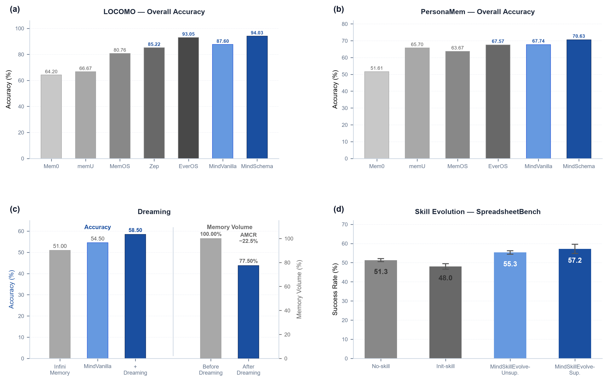

<p align="center">
  
</p>

<p align="center">
  <a href="https://mindmemos.cn">
    
  </a>
  <a href="https://mindmemos.cn/api-docs">
    
  </a>
  <a href="https://pypi.org/project/mindmemos-sdk/">
    
  </a>
  <a href="https://www.npmjs.com/package/@mindmemos/openclaw-plugin">
    
  </a>
  <a href="#license">
    
  </a>
</p>

<p align="center">
  <strong><a href="README_ZH.md">简体中文</a></strong>
  &nbsp;&nbsp;│&nbsp;&nbsp;
  <strong><a href="https://mindmemos.cn">Website</a></strong>
  &nbsp;&nbsp;│&nbsp;&nbsp;
  <strong><a href="https://mindmemos.cn/api-docs">API Docs</a></strong>
  &nbsp;&nbsp;│&nbsp;&nbsp;
  <strong><a href="https://pypi.org/project/mindmemos-sdk/">PYPI SDK</a></strong>
  &nbsp;&nbsp;│&nbsp;&nbsp;
  <strong><a href="docs/deploy/instruction.md">Deployment Guide</a></strong>
</p>

<p align="center">
  Accurately remember user and task context and reuse it across agents; evolve memory through ongoing interactions, automatically distill Skills, and connect with file-based knowledge systems so experience truly becomes capability.
</p>

> ⭐ **Star us on GitHub to automatically upgrade to a Pro quota membership.**

## 📰 News

- **2026-08-14**: We released the [MindMemOS 1.0 technical report](https://arxiv.org/abs/2608.12428), *MindMemOS: A Portable and Self-Evolving Memory Operating Layer for AI Agents*.
- **2026-07-17**: MindMemOS integrated with [LLM4AD_NEXT](https://github.com/Optima-CityU/LLM4AD_Next), providing searchable long-term memory for algorithm design tasks and enabling the accumulation and reuse of cross-task experience, domain knowledge, and constraints.
- **2026-06-30**: MindMemOS was officially released!

## 🌟 Core Features

- **Portable across agents**: Persist user profiles, preferences, project facts, tool experience, and skill candidates as reusable assets, allowing OpenClaw, Hermes, Claude Code, OpenHands, and other agents to share or transfer the same long-term memory.
- **Self-evolving memory system**: Continuously improve memory quality through schema learning, dreaming, and feedback by automatically learning frequent memory patterns, consolidating memories offline, and using interaction corrections to optimize add/search workflows.
- **Memory and Skills integration**: Experience memories can be distilled into skill candidates, while skill execution results, failure traces, and user feedback flow back into the memory system to drive continuous skill evolution.
- **Plugin integrations**: Connect MindMemOS to different agents and workflows through plugins that retrieve and inject relevant memories before interactions and automatically write conversations back afterward. The [OpenClaw Plugin](https://www.npmjs.com/package/@mindmemos/openclaw-plugin) is currently available, with more integrations in progress.

<p align="center">
  
</p>

## 🚀 Quick Start

MindMemOS offers **two deployment modes** (official cloud service, local self-hosting) and **three access methods** (HTTP API, Python SDK / CLI, agent plugin). Any combination works — server and client speak the same protocol:

| Access Method | Use Case | Cloud base_url | Local base_url |
| :--- | :--- | :--- | :--- |
| [HTTP API](https://mindmemos.cn/api-docs) | Call directly from business apps | `https://mindmemos.cn` | `http://127.0.0.1:8000` |
| [Python SDK / CLI](https://pypi.org/project/mindmemos-sdk/) | Integrate into business apps | `https://mindmemos.cn` | `http://127.0.0.1:8000` |
| [OpenClaw Plugin](https://www.npmjs.com/package/@mindmemos/openclaw-plugin) | Agent auto-recalls / writes memory | `https://mindmemos.cn` | `http://127.0.0.1:8000` |

To try it without deploying, use the official cloud service (request an API key on the [website](https://mindmemos.cn)); for on-premises or offline use, start with Local Deployment below.

### 1. Local Deployment

MindMemOS uses `uv` to manage dependencies and run local commands. For detailed configuration instructions, see [docs/deploy/instruction.md](docs/deploy/instruction.md).

#### 1.1 Prepare Configuration Files

```bash
cp .env.example .env
cp config/mindmemos/dev.example.yaml config/mindmemos/dev.yaml
```

Before startup, configure at least the following three model routers in `config/mindmemos/dev.yaml`:

- `chat_model_router`: supports memory extraction, Skill evolution, and other generation tasks.
- `embed_model_router`: generates semantic embeddings; make sure its dimensions match the Qdrant dimension configuration.
- `rerank_model_router`: optional; reranks memory retrieval results.

Configure an API key and its bound `project_id` in `config/mindmemos/api_keys.yaml`.

#### 1.2 Start the Service

Start the local service:

```bash
make dev
```

`make dev` starts the full Docker dependency stack before starting FastAPI.

To start only core dependencies:

```bash
make dev-core          # Qdrant + Neo4j + Kafka
make db-observability  # Qdrant + Neo4j + Kafka + ClickHouse + OTel + Grafana
```

The default local service port is 8000:

```text
FastAPI:   http://127.0.0.1:8000
```

Stop the local service:

```bash
make dev-down
```

### 2. Access Methods

Cloud and local self-hosting use the same access protocol. Local keys come from `config/mindmemos/api_keys.yaml`; cloud keys are obtained from the [website](https://mindmemos.cn).

#### 2.1 HTTP API

HTTP is the base access method — the SDK and plugins also talk HTTP underneath. Once the service is up, first use curl to verify the endpoints work, then wire up your business logic. Define the address and key before calling (pick local or cloud):

```bash
export BASE_URL=http://127.0.0.1:8000   # Local self-host; change to https://mindmemos.cn for cloud
export API_KEY=dev-api-key-001          # Local example key; use a website-issued key for cloud
```

Add a memory:

```bash
curl -sS -X POST "$BASE_URL/v1/memory/add" \
  -H "Authorization: Bearer $API_KEY" \
  -H "Content-Type: application/json" \
  -d '{
    "user_id": "u_123",
    "messages": [{"role": "user", "content": "I like iced Americanos."}]
  }'
```

Search memories:

```bash
curl -sS -X POST "$BASE_URL/v1/memory/search" \
  -H "Authorization: Bearer $API_KEY" \
  -H "Content-Type: application/json" \
  -d '{"query": "What kind of coffee does the user like?", "top_k": 3}'
```

A `code` of `ok` with readable memory content means the access works. curl is just a smoke-test helper; the shown format is for bash. Other environments / languages and the remaining endpoints (get / list / delete / update / feedback / dreaming / skills, etc.) are all covered in the [API docs](https://mindmemos.cn/api-docs).

#### 2.2 Configure the SDK

Install the Python SDK:

```bash
pip install mindmemos-sdk
```

Run the authentication command and configure the service address, API key, and default user when prompted:

```bash
mindmemos auth
```

| Setting | Local Service | Cloud Service |
| :--- | :--- | :--- |
| `base_url` | `http://127.0.0.1:8000` | `https://mindmemos.cn` |
| `api_key` | An enabled API key from `config/mindmemos/api_keys.yaml` | An API key obtained from the [MindMemOS website](https://mindmemos.cn) |
| `user_id` | A stable identifier for the current end user, such as `u_123` | A stable identifier for the current end user, such as `u_123` |

The configuration is saved to `~/.mindmemos/settings.json`. Check the current configuration with:

```bash
mindmemos config show
```

The local service automatically determines the `project_id` and memory algorithm from the API key, so SDK calls do not need to pass `project_id`. The `user_id` distinguishes users within the same project and can be overridden in an individual `add` or `search` call.

If you prefer not to use the local configuration file, pass connection parameters explicitly when creating the client:

```python
from mindmemos_sdk import MindMemOSClient

with MindMemOSClient(
    base_url="http://127.0.0.1:8000",
    api_key="<api_key>",
    user_id="u_123",
) as client:
    ...
```

Explicit parameters take precedence over values in `~/.mindmemos/settings.json`.

#### 2.3 Add and Search Memories with the SDK

After completing the configuration above, `MindMemOSClient()` automatically reads the service address, API key, and default `user_id`. The SDK adds the authentication header automatically, so there is no need to construct HTTP requests manually:

```python
from mindmemos_sdk import DialogueMessage, MindMemOSClient

with MindMemOSClient() as client:
    add_result = client.memory.add(
        messages=[
            DialogueMessage(
                role="user",
                content="I like iced Americanos.",
            )
        ],
        mode="sync",
    )

    for item in add_result.memories:
        print(item.operation, item.memory_id, item.content)

    search_result = client.memory.search(
        "What kind of coffee does the user like?",
        top_k=5,
        search_strategy="fast",
    )

    for memory in search_result.memories:
        print(memory.id, memory.memory)
```

Trigger cloud evolution for a registered Skill:

```python
from mindmemos_sdk import MindMemOSClient

with MindMemOSClient() as client:
    result = client.skills.evolve("my-skill", mode="sync")

    print("evolved:", result.evolved)
    print("pending:", result.pending_count)
    print("threshold:", result.threshold)
    print("new versions:", result.new_version_ids)
```

Local and cloud services use the same SDK call pattern. To switch between them, reconfigure only the `base_url` and corresponding API key.

#### 2.4 Use the CLI

After running `mindmemos auth`, you can also add and search memories directly with the CLI included in the SDK:

```bash
mindmemos memory add --content "I like iced Americanos"
mindmemos memory search "coffee preferences" --top-k 5
```

The `memory` subcommand also supports get / update / delete / feedback / dreaming, and the `skill` subcommand supports register / list / evolve / push / pull / history and more. For the full command list, parameter reference, and troubleshooting, see the [CLI Guide](docs/cli/instruction.md).

#### 2.5 OpenClaw Plugin

**Installing via our [`mindmemos-cli` skill](skills/mindmemos-cli/SKILL.md) is recommended**: deploy `skills/mindmemos-cli/` to your agent's skills directory and let the agent follow its instructions. The skill's [reference docs](skills/mindmemos-cli/references/openclaw-plugin.md) cover installation, permissions, and common troubleshooting.

<details>
<summary><b>Manual installation (not recommended)</b></summary>

**First install the SDK and complete `auth` configuration (required)**: the plugin communicates with the local machine through the `mindmemos` CLI, so you must install the Python SDK first and make sure the `mindmemos` command is available:

```bash
pip install mindmemos-sdk    # or: uv add mindmemos-sdk
mindmemos --version          # confirm the command is available
```

Then configure `base_url`, API key, and `user_id` with `mindmemos auth` (pointing at either the cloud or a local service):

```bash
mindmemos auth
mindmemos config show        # confirm the configuration took effect
```

> Skipping these two steps before installing the plugin causes the logs to error out (`mindmemos` command not found / auth not configured), and the plugin will not be able to read or write memories properly.

Install and enable the plugin:

```bash
openclaw plugins install @mindmemos/openclaw-plugin
openclaw plugins enable mindmemos-memory
```

(`@mindmemos/openclaw-plugin` is the npm package name; `mindmemos-memory` is the plugin id.) Manual installation easily runs into two pitfalls:

- **Write permission (required)**: the plugin's `agent_end` write hook needs `allowConversationAccess`; otherwise everything looks fine, but memories are never actually stored after a turn:
  ```bash
  openclaw config set plugins.entries.mindmemos-memory.hooks.allowConversationAccess true
  openclaw gateway restart
  ```
- **`cli` PATH**: an OpenClaw process launched from the GUI does not inherit your terminal PATH. Configure `mindmemos` as an absolute path or wrap it with `uv run mindmemos`, or the logs will report `ENOENT`.

Once installed, enabled, and the gateway restarted, the plugin recalls and injects relevant memories before each user turn and writes the conversation back automatically when the turn ends.

Full commands, configuration options, and troubleshooting are in the [OpenClaw plugin integration docs](skills/mindmemos-cli/references/openclaw-plugin.md).

</details>

## 📊 Benchmark

### 💬 Conversational Memory: LoCoMo

- **Benchmark**: [LoCoMo](https://arxiv.org/abs/2402.17753), a mainstream benchmark for long-conversation memory covering single-hop, multi-hop, temporal, and open-domain question answering.

| Method                       | Single-hop | Multi-hop | Temporal | Open-domain | Overall |
| :--------------------------- | :--------: | :-------: | :------: | :---------: | :-----: |
| Mem0                         | 68.97 | 61.70 | 58.26 | 50.00  | 64.20 |
| MemU                         | 74.91 | 72.34 | 43.61 | 54.17  | 66.67 |
| MemOS                        | 85.37 | 79.43 | 75.08 | 64.58  | 80.76 |
| Zep                          | 90.84 | 81.91 | 77.26 | 75.00  | 85.22 |
| EverOS                       | 96.67 | 91.84 | 89.72 | 76.04  | 93.05 |
| **MindMemOS-MindVanilla**    | 92.03 | 85.82 | 83.80 | 66.67  | 87.60 |
| **MindMemOS-MindSchema**     | **96.79** | **93.97** | **90.34** | **82.29** | **94.03** |

### 👤 User Profile Memory: PersonaMem

- **Benchmark**: [PersonaMem](https://arxiv.org/abs/2504.14225), a memory benchmark centered on user profiles and preference understanding that evaluates recall, tracking, revisiting, suggestion, recommendation, and generalization of user traits.

| Method | Recall | Ack. Lat. | Trk. Evo. | Revisit | Suggest | Recom. | General. | Overall |
| :----- | :----: | :-------: | :-------: | :-----: | :-----: | :-----: | :------: | :-----: |
| Mem0 | 46.51 | 41.18 | 65.47 | 90.91 | 12.90 | 34.55 | 43.86 | 51.61 |
| MemU | 64.34 | 64.71 | 66.20 | 87.88 | 31.18 | 67.27 | 84.21 | 65.70 |
| MemOS | 53.49 | 82.35 | 66.91 | 79.80 | 41.94 | 69.09 | 75.44 | 63.67 |
| EverOS | 74.42 | 64.71 | 64.03 | 85.86 | 35.48 | 65.45 | 84.21 | 67.57 |
| **MindMemOS-MindVanilla** | 76.74 | 88.24 | 65.47 | 87.88 | 17.20 | 80.00 | 82.46 | 67.74 |
| **MindMemOS-MindSchema** | 81.40 | 64.71 | 64.75 | 82.83 | 47.31 | 76.36 | 73.68 | 70.63 |

### 🌙 Memory Consolidation: MemoryAgentBench (FactConsolidation)

- **Benchmark**: [MemoryAgentBench](https://arxiv.org/abs/2507.05257) FactConsolidation. Scores in the table are the average Substring Exact Match across four context sizes.

| Method                             | SH score | SH archived | MH score | MH archived |
|:-----------------------------------| :------: | :---------: | :------: | :---------: |
| **GPT-4o-mini**                    |  |  |  |  |
| Mem0                               | 0.180 | — | 0.020 | — |
| MemoRAG                            | 0.270 | — | 0.070 | — |
| HippoRAG-v2                        | 0.540 | — | 0.050 | — |
| MindMemOS-MindVanilla              | 0.635 | — | 0.118 | — |
| **MindMemOS-MindVanilla + Dreaming** | 0.738 | 21.4% | 0.180 | 19.4% |
| **GPT-5-mini**                     |  |  |  |  |
| Infini Memory                      | 0.800 | — | 0.220 | — |
| MindMemOS-MindVanilla              | 0.900 | — | 0.190 | — |
| **MindMemOS-MindVanilla + Dreaming** | 0.920 | 23.5% | 0.250 | 21.5% |

### 🧠 Skill Self-Evolution: SpreadsheetBench-Verified

- **Benchmark**: [SpreadsheetBench-Verified](https://huggingface.co/datasets/KAKA22/SpreadsheetBench/blob/main/spreadsheetbench_verified_400.tar.gz), a 400-task verified subset of SpreadsheetBench covering diverse real-world spreadsheet operations.

| Method | Success Rate | Time / Task (s) | Agent Tokens | Evolve Tokens |
| :----- | :----------: | :-------------: | :----------: | :-----------: |
| No-skill | 51.3% ± 0.8% | 11.227 | 10.4M | - |
| Init-skill | 48.0% ± 1.4% | 15.350 | 16.9M | - |
| **MindMemOS-MindEvolve-Unsup.** | **55.3% ± 0.9%** | 15.470 | 27.3M | 5.8M |
| **MindMemOS-MindEvolve-Sup.** | **57.2% ± 2.4%** | 15.631 | 25.2M | 5.5M |

## 🗺️ Coming Features

- **Lite mode**: Designed around low dependencies, replaceable components, and easy embedding, with database backends, async tasks, and log storage decoupled into flexible lightweight components that support in-memory calls and simplified deployment.
- **Skills system**: Govern large and redundant skill libraries and distribute them intelligently; continuously evolve and optimize skills based on real usage; automatically synthesize new skills from frequent user scenarios and refine them through offline simulation.
- **File system memory**: Structure scattered knowledge from local files, documents, project artifacts, and agent outputs into searchable and connected file knowledge objects or knowledge graphs, helping agents complete user tasks more effectively.
- **Agent integrations**: Continue expanding support for coding agents, OpenClaw, Codex-style workflows, and long-running multi-agent systems.

## Contributing

Contributions of all kinds are welcome. Please open pull requests against the `develop` branch. After review,
accepted changes will be merged into `develop`; maintainers periodically merge stable `develop` updates into `main`
for release.

## 💬 Community

Join the MindMemOS Feishu group for project updates, usage discussions, and community participation.

<p align="center">
  
</p>

## 📝 Citation

If you find MindMemOS useful in your research, please cite our technical report:

```bibtex
@misc{liang2026mindmemos,
  title        = {MindMemOS: A Portable and Self-Evolving Memory Operating Layer for AI Agents},
  author       = {Liang, Kaichao and Cui, Yuqi and Kong, Hao and Huang, Xinyuan and Hou, Guohaotian and Kang, Qingcan and Chen, Liang and Yin, Yiyang and Ye, Ke and Guo, Jiaquan and Chen, Da and Zeng, Lingan and Peng, Yixing and Yao, Rong and Kai, Shixiong and Yuan, Mingxuan},
  year         = {2026},
  eprint       = {2608.12428},
  archivePrefix= {arXiv},
  primaryClass = {cs.AI},
  url          = {https://arxiv.org/abs/2608.12428},
}
```

## 📄 License

This project is open source under the MIT License.
