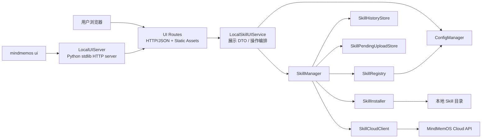
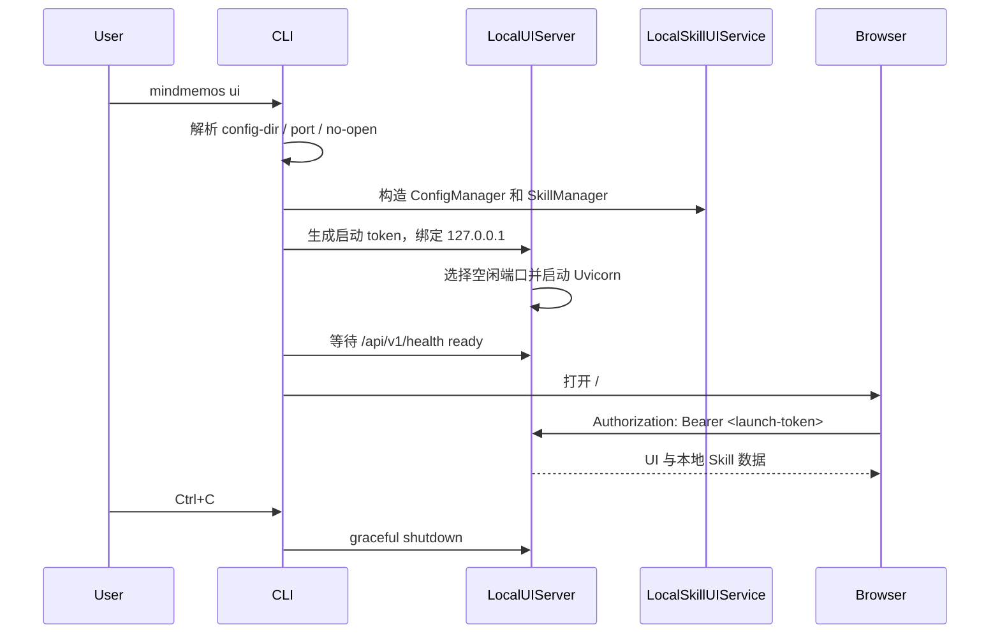

# MindMemOS 本地 SDK 管理控制台架构设计

> 状态：设计稿与当前实现对照；本地 Python 服务、Memory、Skill、Settings 和版本管理已接入
> 目标包：`mindmemos_sdk`
> 用户入口：`mindmemos ui`

## 1. 背景

MindMemOS 需要一个在用户本机运行的 SDK 可视化管理界面，用来查看和管理 SDK 已注册的
Skill、版本历史、本地修改、用户自己的 Memory，以及相关配置。

本界面应满足以下约束：

- 用户侧只要求 Python 和一个现代浏览器。
- 用户不需要安装 Node.js、Docker、数据库或桌面 GUI 运行时。
- 界面风格与 MindMemOS 云端控制台保持一致。
- 服务只面向本机单用户，不设计成可远程访问的多用户服务。
- 复用 `mindmemos_sdk` 已有的 Skill 管理能力和本地状态，不创建第二套 registry、
  history、cache 或云端同步实现。

## 2. 架构决策

### 2.1 服务归属

本地 UI 服务放在 `mindmemos_sdk`，而不是 `mindmemos_skill` 或服务端 `mindmemos` 包。

原因如下：

- `mindmemos_sdk` 已经提供 `mindmemos` CLI，适合承载用户本地启动入口。
- `mindmemos_sdk.skills.SkillManager` 已经是本地 Skill 生命周期的应用层入口。
- SDK 已经持有本地配置、API key、注册表、版本历史、内容缓存和待上传队列。
- 浏览器不应直接访问 MindMemOS 云端 API，也不应接触 API key。
- `mindmemos_skill` 应继续聚焦可复用 Skill 定义、运行时组件和算法，不负责本地 Web
  服务生命周期。

### 2.2 UI 形态

采用“本地 Python 服务 + 浏览器”的形式：

```text
mindmemos ui
        |
        v
127.0.0.1 上的本地 Python 服务
        |
        +-- /                  预编译 React 页面
        +-- /api/v1/*          本地配置、Memory 和 Skill 管理 API
        |
        v
自动打开用户默认浏览器
```

不采用以下方案：

- Electron、Tauri 或 pywebview：会引入平台相关运行时和打包流程。
- Streamlit、Gradio 或 NiceGUI：运行依赖更多，且难以复用现有云端 React 视觉体系。
- 运行时 Babel、CDN React 或远程字体：离线环境不可用，也不利于可重复分发。
- 把本地 UI 暴露到 `0.0.0.0`：本项目不是远程管理服务。

### 2.3 前端技术

当前版本使用零构建依赖的 HTML + CSS + 原生 JavaScript shell。这样可以在 SDK 仓库中
直接迭代视觉和交互，同时保持最终用户只需要 Python 和浏览器。静态资源位于
`mindmemos_sdk/ui/static/`，并通过 `uv_build` 原样打进 wheel：

```text
index.html + app.css + app.js
    |
    | uv build
    v
mindmemos_sdk/ui/static/*  (wheel)
```

如果后续需要 React，React/Vite 只应作为开发和发布阶段的构建工具；浏览器和 wheel
仍然只接收编译后的资源，不能依赖运行时 Node.js、CDN 或远程字体。

### 2.4 Python 服务

当前实现使用 Python 标准库 `http.server`，不新增 FastAPI、Uvicorn 或其他 Web 框架依赖。
SDK 已有的 Pydantic、HTTPX 和 PyYAML 依赖继续由配置和云端 Skill 客户端使用。用户的
安装体验保持为：

```bash
pip install mindmemos-sdk
mindmemos ui
```

如果未来需要更复杂的中间件或 SSE，可以在不改变模块边界的情况下增加可选的
`mindmemos-sdk[ui]` 依赖；当前版本不需要这层复杂度。

## 3. 当前已实现的 SDK 能力

本节描述当前代码中的事实；尚未实现的变更能力在后文明确标注。

### 3.1 CLI

`mindmemos_sdk.cli` 已注册 `mindmemos` 命令，并提供：

- `mindmemos auth`
- `mindmemos config ...`
- `mindmemos skill register/list/show/pull/push/update/rollback/history/diff/unregister`
- `mindmemos memory ...`
- `mindmemos doctor`

本设计增加独立的顶层 UI 命令；它不属于 `skill` 子命令，因为同一个控制台统一管理
Memory、Skill 和 Settings：

```bash
mindmemos ui
```

建议参数：

```text
--port PORT       指定端口；省略时由系统选择空闲端口
--no-open         不自动打开浏览器，只打印 URL
--config-dir DIR  覆盖 SDK 配置目录
```

首版不提供 `--host`，服务固定绑定 `127.0.0.1`。

### 3.2 Skill 应用层

`mindmemos_sdk.skills.SkillManager` 已提供：

- 注册与上传：`register`
- 本地列表与查询：`list`、`show`
- 本地修改上传：`push`
- 云端元数据拉取：`pull`
- 更新检测与应用：`sync`、`plan_update`、`update`、`update_all`
- 回滚：`plan_rollback`、`rollback`
- 历史与差异：`history`、`diff`
- 注销：`unregister`
- 离线待上传队列：`enqueue_pending_upload`、`pending_uploads`、
  `flush_pending_uploads`
- Memory add 的 Skill 上下文：`ensure_skill_context`

UI API 必须委托这些公开方法，不能在路由中复制注册、同步、回滚、缓存或内容哈希逻辑。

### 3.3 云端适配

`SkillCloudClient` 通过 SDK 的 `HttpTransport` 访问云端 Skill API，当前覆盖：

- 注册 Skill
- 查询 Skill 列表和版本
- 获取版本内容
- 触发 evolve
- 同步 published head
- 删除云端 Skill

本地 UI 前端不会直接请求云端。请求路径为：

```text
Browser
  -> Local UI API
  -> LocalSkillUIService
  -> SkillManager
  -> SkillCloudClient
  -> HttpTransport
  -> MindMemOS Cloud API
```

这样可以复用 SDK 的超时、重试、错误模型和认证配置，并确保 API key 不进入浏览器。

### 3.4 本地数据

当前 SDK 的本地状态如下：

| 数据 | 默认位置 | 所有者 |
| --- | --- | --- |
| 认证、默认用户和 Skill registry | `~/.mindmemos/settings.json` | `ConfigManager` / `SkillRegistry` |
| Skill 版本历史 | `~/.mindmemos/skill_history.json` | `SkillHistoryStore` |
| 待上传队列 | `~/.mindmemos/skill_pending_uploads.json` | `SkillPendingUploadStore` |
| 内容快照 | `~/.mindmemos/skills/cache/<content_hash>` | `SkillHistoryStore` |
| 更新和回滚备份 | `~/.mindmemos/skills/backups/` | `SkillInstaller` |
| Skill 工作目录 | registry 中记录的绝对路径 | 用户 / `SkillInstaller` |

配置目录可通过 `MINDMEMOS_CONFIG_DIR` 覆盖。

现有 JSON 存储使用临时文件加 `os.replace` 原子写入。首版 UI 不新增 SQLite 或其他
数据库。

## 4. 目标总体架构



### 4.1 分层职责

| 层 | 职责 | 禁止事项 |
| --- | --- | --- |
| React UI | 展示、筛选、确认操作、调用本地 API | 读取本地文件、保存 API key、直接访问云端 |
| UI Routes | HTTP 参数解析、token 校验、错误映射、返回 DTO | 实现 Skill 业务逻辑 |
| `LocalSkillUIService` | 聚合页面数据、调用 `SkillManager`、生成 UI DTO | 绕过 manager 直接改 registry/history |
| `SkillManager` | Skill 生命周期、版本、同步、回滚、缓存和 outbox | 依赖 FastAPI 或前端 DTO |
| Store / Installer | 原子持久化、文件备份和恢复 | 决定 HTTP 状态码或页面行为 |
| `SkillCloudClient` | 云端 Skill API 适配 | 接触浏览器状态 |

### 4.2 为什么增加 `LocalSkillUIService`

HTTP 路由不应直接拼装多个 store 的状态。新增一个只属于 SDK UI 的应用服务：

```python
class LocalSkillUIService:
    def list_skills(self) -> list[SkillListItem]: ...
    def get_skill(self, skill_ref: str) -> SkillDetail: ...
    def get_status(self) -> LocalUIStatus: ...
    def register_skill(self, request: RegisterSkillRequest) -> SkillDetail: ...
    def push_skill(self, skill_ref: str) -> OperationResult: ...
    def update_skill(self, skill_ref: str) -> OperationResult: ...
    def rollback_skill(self, skill_ref: str, version_id: str) -> OperationResult: ...
```

它负责：

- 把 SDK 模型转换成稳定的 UI DTO。
- 聚合本地 hash 状态、云端状态、pending upload 和版本历史。
- 对未认证、离线和未注册等情况提供可展示的状态。
- 调用 `SkillManager` 的公开方法执行操作。
- 把 SDK 异常归一化成 UI 可消费的错误码。

它不拥有新的持久化状态。

## 5. 建议目录结构

```text
src/mindmemos_sdk/
├── frontend/                         # React/Vite 源码，仅开发和构建使用
│   ├── package.json
│   ├── vite.config.*
│   └── src/
│       ├── app/
│       ├── components/
│       ├── pages/
│       ├── api/
│       └── styles/
└── mindmemos_sdk/
    ├── cli.py                        # 增加 mindmemos ui
    ├── skills/                       # 已有领域和应用逻辑
    └── ui/
        ├── __init__.py
        ├── app.py                    # create_local_ui_app(...)
        ├── server.py                 # 端口、启动、ready、浏览器、shutdown
        ├── security.py               # token、Host/Origin、响应头、路径约束
        ├── service.py                # LocalSkillUIService
        ├── schemas.py                # UI 专用 request/response DTO
        ├── errors.py                 # SDK error -> UI error
        ├── routes/
        │   ├── system.py
        │   └── skills.py
        └── static/                   # Vite 构建产物，随 wheel 分发
            ├── index.html
            └── assets/
```

`static/` 是构建产物，不是前端源码。Python 使用 `importlib.resources` 访问 wheel 中的
静态资源，不能依赖源码仓库的相对路径或当前工作目录。

## 6. 启动与生命周期

### 6.1 启动顺序



### 6.2 生命周期规则

- CLI 进程拥有 Uvicorn 的启动和关闭。
- 服务不是 daemon，不写 PID 文件。
- 关闭浏览器不会自动结束服务；用户使用 `Ctrl+C`。
- `Ctrl+C` 后先停止接受新请求，再等待当前请求结束。
- UI 启动不依赖云端连通性；离线时仍可展示本地 Skill 和缓存历史。
- API key 缺失时 UI 仍能启动，云端操作按钮显示为不可用，并引导用户运行
  `mindmemos auth`。
- 自动打开浏览器失败时不视为服务启动失败，终端保留可复制 URL。

### 6.3 端口策略

默认让操作系统选择空闲端口，避免固定端口冲突：

```bash
mindmemos ui
```

需要固定端口时：

```bash
mindmemos ui --port 8765
```

服务始终绑定 `127.0.0.1`。

## 7. 本地 HTTP API

API 前缀固定为 `/api/v1`，前端静态资源挂载在 `/`。首版不启用 CORS。

### 7.1 系统接口

| 方法 | 路径 | 用途 |
| --- | --- | --- |
| `GET` | `/api/v1/health` | ready/liveness，不返回敏感数据 |
| `GET` | `/api/v1/status` | SDK 配置状态、云端连通状态、版本和配置目录 |
| `GET` | `/api/v1/config` | 返回脱敏配置 |

`/api/v1/config` 不返回完整 API key，只返回 `configured: true/false` 和掩码。

### 7.2 Skill 查询接口

| 方法 | 路径 | 委托 |
| --- | --- | --- |
| `GET` | `/api/v1/skills` | `SkillManager.list()` |
| `GET` | `/api/v1/skills/{skill_ref}` | `SkillManager.show()` |
| `GET` | `/api/v1/skills/{skill_ref}/history` | `SkillManager.history()` |
| `GET` | `/api/v1/skills/{skill_ref}/diff` | `SkillManager.diff()` |
| `GET` | `/api/v1/skills/{skill_ref}/pending-uploads` | `SkillManager.pending_uploads()` 过滤 |

列表接口支持前端需要的查询参数，例如 `query`、`hash_state` 和 `has_update`，但筛选只
作用于返回结果，不改变 SDK registry 语义。

### 7.3 Skill 变更接口

| 方法 | 路径 | 委托 |
| --- | --- | --- |
| `POST` | `/api/v1/skills/register` | `SkillManager.register()` |
| `POST` | `/api/v1/skills/{skill_ref}/pull` | `SkillManager.pull()` |
| `POST` | `/api/v1/skills/{skill_ref}/push` | `SkillManager.push()` |
| `POST` | `/api/v1/skills/{skill_ref}/update` | `SkillManager.update()` |
| `POST` | `/api/v1/skills/{skill_ref}/rollback` | `SkillManager.rollback()` |
| `POST` | `/api/v1/pending-uploads/flush` | `SkillManager.flush_pending_uploads()` |
| `DELETE` | `/api/v1/skills/{skill_ref}` | `SkillManager.unregister()` |

更新和回滚应先通过查询接口展示 plan/diff，再由用户确认提交。删除本地文件不进入首版
HTTP API；首版 unregister 只移除 SDK 管理状态，避免浏览器请求直接删除用户目录。

### 7.4 返回格式

成功响应：

```json
{
  "data": {},
  "meta": {
    "request_id": "local_..."
  }
}
```

错误响应：

```json
{
  "error": {
    "code": "skill_not_found",
    "message": "skill not found: example",
    "details": {}
  },
  "meta": {
    "request_id": "local_..."
  }
}
```

前端只依赖稳定的 `code`，不解析 Python 异常文本。

## 8. 本地安全模型

本地服务仍然需要防止恶意网页请求 localhost、DNS rebinding、路径越界和意外暴露凭据。

### 8.1 网络边界

- 只绑定 `127.0.0.1`。
- 不提供远程监听参数。
- 只接受预期的 `Host`：当前 `127.0.0.1:<port>` 和 `localhost:<port>`。
- 不启用跨域访问。
- 对带 `Origin` 的请求要求同源。

### 8.2 启动 token

每次启动生成高熵临时 token：

```text
http://127.0.0.1:<port>/#token=<launch-token>
```

token 放在 URL fragment 中，fragment 不会进入 HTTP 请求日志。React 启动后读取 token，
只保存在内存，并在 API 请求中发送：

```http
Authorization: Bearer <launch-token>
```

所有 `/api/v1/*` 接口都需要 token，`health` 可以只返回固定的最小 ready 状态。服务退出
后 token 失效。

### 8.3 文件边界

- UI 不提供任意目录浏览 API。
- 已注册 Skill 只能操作 `SkillRecord.path` 指向的目录。
- 注册操作接收用户明确输入的路径，并通过 `Path.expanduser().resolve()` 规范化。
- 注册路径必须存在，并满足 SDK 当前的 Skill bundle 校验规则。
- 所有相对文件路径在读写前检查规范化结果仍位于 Skill 根目录。
- 前端不能直接指定 cache、backup、settings 或 history 文件路径。
- API key、完整 settings 内容和本地缓存内容不进入日志。

### 8.4 浏览器响应头

至少设置：

```text
Content-Security-Policy
X-Content-Type-Options: nosniff
X-Frame-Options: DENY
Referrer-Policy: no-referrer
Cache-Control: no-store        # API
```

前端资源不使用 CDN，CSP 只允许本地静态资源和本地 API。

## 9. 并发与一致性

当前 store 的单次文件替换是原子的，但多个进程同时执行 read-modify-write 仍可能产生
lost update。

首版约束：

- UI 服务内部的所有变更操作使用同一个进程内 mutation lock 串行执行。
- 一个浏览器中的重复提交使用 operation id 防止误重试。
- 不支持在 UI 执行变更时并行运行修改同一 Skill 的 CLI 命令。
- 文档和 UI 明确提示单写者约束。
- plan 和 apply 之间重新检查当前 `content_hash`；状态已变化时返回 conflict，而不是覆盖。

后续如果需要 UI 和 CLI 多进程并发写入，再给 SDK store 增加配置目录级跨进程锁或
revision/CAS。不能只在 FastAPI 路由层补锁，因为 CLI 与 Python SDK 也会写同一状态。

## 10. 前端信息架构与视觉复用

### 10.1 视觉来源

视觉参考来自 `MindMemOS-account-ui` 仓库中的 `ui-v2/MindMemOS`：

- `src/styles.css`：颜色、字体、边框、圆角、按钮、输入框、卡片
- `src/shell.jsx`：顶部导航、PageHeader、StatStrip
- `src/ui.jsx`：图标、Modal、Toast
- `src/memories.jsx`：列表/详情和关系图视图

本地 UI 复制并适配这些设计 token 和通用组件，但构建和运行时不依赖
`MindMemOS-account-ui` 仓库。

必须移除当前原型中的：

- CDN React 和浏览器内 Babel
- Google Fonts 网络请求
- 云端账户登录、套餐、计费和 quota 演示状态
- 只为原型准备的 mock data 和 tweak panel

字体、图标和前端依赖在构建时固化进 wheel。

### 10.2 页面映射

| 云端控制台概念 | 本地 SDK 控制台 |
| --- | --- |
| Dashboard | 本地 Skill 总览 |
| Projects | Skill 工作区/来源 |
| API Keys | SDK 配置状态，不显示完整密钥 |
| Memories | 当前用户的 Memory 列表/搜索 |
| Memory list/detail | Memory 卡片列表和时间/类型信息 |
| Memory graph | Skill 关系图，后续阶段 |
| Quota chip | `Local` 状态和当前配置目录 |

### 10.3 首版页面

首版包含：

1. 总览
   - 已注册 Skill 数量
   - confirmed / pending / unknown 数量
   - 可更新数量
   - 待上传数量
   - SDK 认证和云端连通状态
2. Memory
   - 当前配置用户的 active memory 列表
   - Memory 类型、内容、更新时间和 ID
   - 按 query 搜索当前用户的 Memory
3. Skills
   - 搜索和状态筛选
   - 左侧 Skill 列表、中间版本选择与可编辑内容、右侧 Skill 信息
   - 保存本地 `SKILL.md`，或以当前本地版本为父版本发布新版本
   - 版本历史、路径、hash、生命周期状态和 pending upload
4. 设置
   - 配置目录
   - base URL
   - API key 是否配置及掩码
   - 默认 user id
   - cache/backup 目录

关系图数据、运行轨迹和多工作区扫描尚未接入；Skills 页面已先预留 Graph 占位界面，Skill Library
提供受本地 SDK 管理的 Markdown 编辑器。

## 11. 安装、构建与分发

### 11.1 用户安装

```bash
pip install mindmemos-sdk
mindmemos auth
mindmemos ui
```

也可以使用隔离工具环境：

```bash
uv tool install mindmemos-sdk
mindmemos ui
```

用户侧不执行 `npm install` 或 `npm run build`。

### 11.2 开发流程

开发时前后端可以分开启动：

```text
Vite dev server
    -> /api 代理到本地 FastAPI

Python local UI server
    -> 使用真实或临时 MINDMEMOS_CONFIG_DIR
```

开发依赖放在前端 `package.json` 和 Python dev dependency group，不进入最终 Python
运行依赖。

### 11.3 发布流程

发布 wheel 前：

1. 安装锁定的前端依赖。
2. 运行前端 lint/test。
3. 执行 Vite production build。
4. 将构建产物写入 `mindmemos_sdk/ui/static/`。
5. 构建 Python wheel。
6. 解包 wheel，确认 `index.html`、带 hash 的 assets 和字体存在。
7. 在无 Node、无源码仓库、无网络的干净 Python 环境中安装 wheel。
8. 启动 `mindmemos ui --no-open` 并验证 health、静态资源和 Skill 列表。

如果静态资源缺失，wheel 构建或发布检查必须失败，不能发布一个运行时再尝试下载前端的
包。

## 12. 测试策略

### 12.1 Python 单元测试

- `LocalSkillUIService` 使用 fake `SkillManager`，验证 DTO 和错误映射。
- CLI 参数、空闲端口和 `--no-open` 行为。
- launch token 校验。
- Host、Origin 和路径越界拒绝。
- API key 脱敏。
- mutation lock 和 content hash conflict。

### 12.2 API 集成测试

- 使用临时 `MINDMEMOS_CONFIG_DIR`。
- 使用 FastAPI TestClient 和 fake `SkillCloudClient`。
- 验证 list/show/history/diff。
- 验证 register/push/update/rollback/unregister 只通过 `SkillManager`。
- 验证云端断开时本地查询仍然工作。
- 验证变更接口不会绕过 backup、cache 和原子写路径。

### 12.3 前端测试

- 空状态、未认证、离线、pending、confirmed、conflict。
- 变更操作二次确认。
- 列表/详情同步和错误 Toast。
- API 响应不包含 API key。

### 12.4 Wheel smoke test

这是发布门槛，而不只是开发检查：

- 干净环境只安装 wheel。
- 环境中没有 Node。
- 禁止外网访问。
- CLI 能启动并打印 URL。
- 浏览器静态资源全部从 localhost 加载。
- `Ctrl+C` 能正常关闭服务。

## 13. 分阶段交付

### Phase 1：只读闭环

- CLI 启动、空闲端口、自动浏览器和 graceful shutdown
- React shell 与云端视觉对齐
- status/config/skills/show/history/diff
- wheel 内静态资源和离线 smoke test
- token、Host、Origin 和敏感信息保护

### Phase 2：本地管理闭环

- register、push、pull
- update plan、diff、确认和 apply
- rollback、unregister
- pending upload 展示与 flush
- UI 内部 mutation lock 和 content hash conflict

### Phase 3：增强可视化

- Skill 关系图
- 更丰富的版本时间线
- 运行轨迹和执行状态
- 多文件 Bundle 编辑器与更细粒度的编辑冲突提示
- 在有明确需求后再评估 SSE；首版不引入 WebSocket

## 14. 非目标

首版明确不做：

- 远程访问和多人协作
- 云端账户、登录、计费和套餐管理
- Electron/Tauri/原生桌面安装包
- 浏览器直接访问云端 API
- 任意本地文件浏览器
- 自动删除未注册 Skill 的工作目录
- 内置 Node.js 或运行时前端编译
- 新的本地数据库
- 重写 `SkillManager` 已有的 Skill 生命周期

## 15. 已知风险和待实现项

| 风险/待实现项 | 当前结论 |
| --- | --- |
| UI 与 CLI 并发修改 | 首版采用单写者约束；后续在 SDK store 层解决跨进程锁 |
| 前端与云端视觉漂移 | 本地维护设计 token 快照；不建立运行时跨仓库依赖 |
| wheel 遗漏静态资源 | 增加解包检查和无 Node 离线 smoke test |
| 恶意网页访问 localhost | loopback、launch token、Host/Origin 校验、无 CORS |
| 注册路径越界 | canonical path、bundle 白名单、禁止任意文件 API |
| 云端不可达 | UI 本地查询可用；云端动作显示明确错误和重试入口 |
| API key 泄露 | 只在 Python 进程加载；前端只接收 configured/masked 状态 |
| 服务端能力被复制 | routes 只调用 `LocalSkillUIService`，后者只编排 `SkillManager` |

## 16. 验收标准

架构首版完成时应满足：

- 用户只安装 `mindmemos-sdk` 即可运行 UI。
- 用户机器不需要 Node、Docker、数据库或平台相关 WebView。
- UI 在断网环境能启动并查看本地已注册 Skill。
- UI 与云端控制台使用同一套核心视觉 token 和交互语言。
- 浏览器看不到完整 API key。
- 本地服务只监听 `127.0.0.1`。
- 所有 Skill 变更复用 `SkillManager`，没有第二套 registry/history/cache。
- 更新和回滚保留现有 plan、diff、backup 和 content hash 语义。
- wheel 在无源码、无 Node、无网络环境通过 smoke test。

## 17. 当前实现与 API 接入范围

SDK 当前已提供一个不依赖额外 Web 框架的本地控制台：

```bash
mindmemos ui
```

它使用 Python 标准库 `http.server` 监听 loopback，wheel 内包含
`mindmemos_sdk/ui/static/` 下的 HTML、CSS 和 JavaScript。服务端 API 只在本地进程中读取
配置、Skill registry、Skill 详情和本地内容，并把配置更新通过 `ConfigManager.save()` 原子
写回配置目录；浏览器不直接接触云端 API key。

当前已接入的接口：

| 方法 | 路径 | 当前行为 |
| --- | --- | --- |
| `GET` | `/api/v1/health` | 返回本地服务 ready 状态 |
| `GET` | `/api/v1/config` | 返回脱敏配置、身份默认值、Memory 默认值、存储/网络状态 |
| `PUT` | `/api/v1/config` | 校验并原子保存 Connection、Identity、Memory 默认值、Storage 和 Network |
| `GET` | `/api/v1/skills` | 读取本地 registry、历史 pending 计数和摘要 |
| `GET` | `/api/v1/skills/{ref}` | 读取本地 Skill 详情和版本历史 |
| `GET` | `/api/v1/skills/{ref}/content` | 读取当前本地或指定历史版本的可编辑 `SKILL.md` 文本 |
| `PUT` | `/api/v1/skills/{ref}/content` | 原子保存编辑器内容到本地 `SKILL.md`，不改变当前版本 ID |
| `POST` | `/api/v1/skills/{ref}/publish` | 保存编辑器内容，并以当前本地版本为父版本发布新的 Skill 版本 |
| `GET` | `/api/v1/memories` | 使用配置的 `base_url`、API key 和 `user_id` 获取该用户的 active memories |
| `GET` | `/api/v1/memories/search?q=...` | 使用同一用户身份搜索 Memory |

注册入口仍保持禁用；编辑保存和发布复用 `SkillManager.save_content()` 与
`SkillManager.push()`，不会在 UI 路由中复制 registry、history 或上传逻辑。

## 18. 当前 UI 信息架构

Memory 浏览页已重新接入。Memory 数据仍然由云端 API 持有，但浏览器只访问本地 Python
服务；本地服务从 SDK 配置读取 URL、API key 和 `user_id`，并将 Memory 请求固定限制在该
用户范围内。顶层导航为四个标签：

```text
Overview | Memory | Skills | Settings
```

- `Overview`：连接状态、身份默认值、Skill 数量、本地存储状态和快捷入口。
- `Memory`：当前用户的 active memory 列表、数量、Memory 类型/时间/ID，以及按 query 搜索。
- `Skills`：左侧 Skill registry，中间版本选择与可编辑内容，右侧 Skill 信息、版本历史和
  pending upload；支持保存本地内容、发布新版本，以及双 Skill 对比。
- `Settings`：Connection、Identity defaults、Skill/请求默认值、本地存储和 Network。

`Skills` 内部提供 `Library / Compare / Graph` 二级视图。Graph 当前是预留的空占位界面；Compare 支持左右两组 Skill/版本选择器，
既可以比较两个 Skill，也可以选择同一个 Skill 的两个历史版本。选择器会从 `/api/v1/skills` 和 `/api/v1/skills/{ref}/content` 自动加载本地内容，并在上方
content 区左右渲染 `SKILL.md` 的 Markdown，同时用红色/绿色标记删除和新增的行内片段。若接口返回 bundle JSON，比较器只取目标文件的
`content` 字段，不展示 `path` 或 JSON 外壳；内容处理只发生在浏览器内，不会写入 SDK 配置或
Skill 文件。

Settings 当前会通过 `/api/v1/config` 加载并保存 Connection、Identity defaults、Memory
搜索/写入默认值、本地目录和 Network；API key 只显示配置状态与掩码，空白 API key 不会覆盖
已有密钥。Memory 列表接口要求配置 `user_id`；未配置用户或云端不可达时，页面显示明确的
错误状态，不展示伪造数据。
