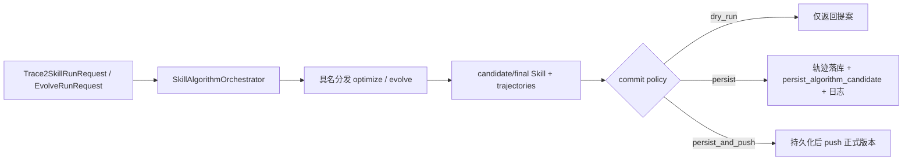

# MindMemOS Skill 新算法开发与接入指南

本文说明如何在 `mindmemos_skill` 中新增一个 Skill 算法，以及如何与模型、Agent、Env、算法日志、LLM 调用日志、Skill 版本存储、远端发布和轨迹采集联动。当前实现中有两类算法路径：

| 路径 | 参考实现 | 入口/输出 | 当前接入状态 |
| --- | --- | --- | --- |
| `trace2skill` | `trajectory_evidence_patch` | `optimize(Trace2SkillInput) -> Trace2SkillOutput` | 由 `SkillApplication.run_trace2skill()` 编排 |
| `evolve` | `skill_grpo_*`、`trajectory_memory` | `evolve(EvolveInput) -> EvolveOutput` | 由 `SkillApplication.run_evolve()` 编排 |

两类都是产品侧 Skill 算法，关键区别是轨迹在算法中的角色。`trace2skill` 主要消费已经存在的离线轨迹，完成一次有界的“轨迹证据到 Skill 候选”转换；为了方便构造数据和做对比，它也允许传入 `Task` 临时采一批轨迹，但这批轨迹只用于模拟离线输入。`evolve` 则把主动采样放在算法循环内部：基于当前 Skill 采样、更新 Skill，再基于新 Skill 进入下一轮，并可主动运行验证集或测试集决定是否接受候选、继续迭代或结束。统一实验入口额外规定：无论算法内部是否消费 test，最终候选都必须在对应 dataset/env 的 test split 上生成统一评测 artifact。

```text
trace2skill: offline trajectories + collect(tasks, base_skill) -> optimize once -> candidate
evolve:      skill_i -> collect(train, skill_i) -> candidate_i -> collect(validation/test, candidate_i)
             -> gate/update -> skill_i+1 -> next iteration
```

## 1. 先确定算法应该放在哪一类

满足下列特征时，优先放入 `algos/trace2skill/<algorithm_name>/`：

- 主要输入是一个 `base_skill` 和一批已经存在的离线 `trajectories`。
- 可选 `tasks` 只用于临时生成一批等价的离线轨迹；采集完成后与传入轨迹合并，走同一次优化。
- 不会拿新生成的 Skill 再次主动采样并继续演进。
- 不会主动运行验证集/测试集来 gate 候选；离线轨迹自带的 reward 或标注只作为证据使用。
- 一次调用产生零个或一个 `SkillCandidate`，不在算法内部创建正式版本或操作远端状态。
- 需要通过 `SkillApplication.run_trace2skill()` 对外提供能力。

满足下列特征时，优先放入 `algos/evolve/<algorithm_name>/`：

- 主动采样是算法演进循环的一部分，而不是单纯补齐输入轨迹。
- 算法基于当前 Skill 采样和更新，并将更新后的 Skill 带入后续 batch/epoch，形成多轮迭代。
- 中间可以主动运行验证集或测试集，执行 candidate gate、early stop、回滚、replay 或 checkpoint。
- 结果需要携带完整的 metrics、rollout outcomes、batch records、state 和 artifacts。

所有 evolve 算法也属于产品侧 Skill 算法。当前配置编译、Service、Application 编排层和 SDK 本地调用已经支持 `evolve`；新增算法只要遵守既有 `optimize` 或 `evolve` capability，就不应再为它单独实现一套存储、日志或发布流程。

## 2. 先理解 Application 算法编排层

[`SkillAlgorithmOrchestrator`](../../src/mindmemos_skill/mindmemos_skill/application/algorithms/orchestrator.py) 是产品侧运行 Skill 算法的标准编排入口。算法本身只负责计算，编排层统一负责解析持久化输入和提交副作用。

### 2.1 trace2skill 编排流程

调用方提交 [`Trace2SkillRunRequest`](../../src/mindmemos_skill/mindmemos_skill/application/algorithms/models.py)：

- `run_id`：一次运行的稳定 ID。
- `algorithm_name`：`runtime.algorithms` 中配置的实例名，不是算法类名。
- `skill_ref` 和可选 `base_version_id`：定位基准 Skill；未指定版本时使用最新版本。
- `trajectory_ids`：已经存在于本地轨迹表的离线轨迹 ID。
- `tasks`：可选的临时主动采集任务；可与 `trajectory_ids` 同时提供。
- `commit_policy`：`dry_run`、`persist` 或 `persist_and_push`。

编排层依次执行：

1. 通过 `LocalSkillManager` 解析基准 Skill 和版本。
2. 根据 `trajectory_ids` 从本地轨迹表加载完整 `Trajectory`。
3. 构造 `Trace2SkillInput(base_skill, trajectories, tasks, run_id)`。
4. 通过 `SkillAlgorithms.optimize(..., algorithm_name=...)` 精确分发到配置实例。
5. 接收 `Trace2SkillOutput`，其中 `candidate` 是内容候选，`trajectories` 是本次算法新生成的轨迹。
6. 按 commit policy 统一落库轨迹、持久化 Skill 版本、可选 push，并写成功或失败日志。

### 2.2 evolve 编排流程

调用方提交 [`EvolveRunRequest`](../../src/mindmemos_skill/mindmemos_skill/application/algorithms/models.py)，其中包含基准 Skill 引用、算法实例名、`train_tasks`、可选 `validation_tasks/test_tasks` 和 commit policy。编排层解析基准 Skill 后构造公共 `EvolveInput`，通过 `SkillAlgorithms.evolve()` 分发。

evolve 算法必须在 `EvolveOutput` 中返回：

- `final_skill` 和 `changed`。
- 本次运行产生的全部 `trajectories`，包括需要保留的失败物理 attempt。
- 具体算法可额外返回 metrics、batch records、state 和 artifacts。

当 `changed=True` 时，编排层将 `final_skill` 转换为无版本身份的 `SkillCandidate`，再由 `LocalSkillManager.persist_algorithm_candidate()` 创建正式 EVOLUTION/DRAFT 子版本；算法内部生成的临时候选 `version_id` 不会成为正式版本 ID。

### 2.3 commit policy

| policy | 新轨迹落库 | Skill 候选持久化 | AlgorithmLog | 远端 push |
| --- | --- | --- | --- | --- |
| `dry_run` | 否 | 否 | 否 | 否 |
| `persist` | 是 | 是 | 是 | 否 |
| `persist_and_push` | 是 | 是 | 是 | 是，仅在产生正式新版本时 |

编排层只持久化算法 output 中的新增轨迹；`Trace2SkillRunRequest.trajectory_ids` 指向的离线输入已经在库中，不会重复写入。新增轨迹落库前会追加 `algorithm_run_id` 和 `algorithm_name` metadata，并按 `trajectory_id` 去重。

### 2.4 公开调用入口

```python
result = await application.run_trace2skill(
    Trace2SkillRunRequest(
        run_id="trace-run-001",
        algorithm_name="trajectory-patch",
        skill_ref="demo",
        trajectory_ids=["trajectory-1", "trajectory-2"],
        tasks=[],
        commit_policy=AlgorithmCommitPolicy.PERSIST,
    )
)

result = await application.run_evolve(
    EvolveRunRequest(
        run_id="evolve-run-001",
        algorithm_name="grpo",
        skill_ref="demo",
        train_tasks=train_tasks,
        validation_tasks=validation_tasks,
        test_tasks=test_tasks,
        commit_policy=AlgorithmCommitPolicy.PERSIST_AND_PUSH,
    )
)
```

SDK 同步管理器提供 `run_trace2skill_local()`、`run_evolve_local()`，`AsyncSkillClient` 提供 `run_trace2skill()`、`run_evolve()`。直接调用 `algorithm.optimize/evolve` 只适合算法单元测试或内部 runner，不会经过上述统一副作用提交。

## 3. 推荐目录结构

一个可合入 Application 的 trace2skill 算法建议包含：

```text
src/mindmemos_skill/mindmemos_skill/algos/trace2skill/
├── base.py                         # Trace2SkillAlgorithm 公共协议
├── collection.py                   # 可复用的 Task 主动采集适配
├── evidence.py                     # 跨算法复用的轨迹规范化/筛选
└── my_algorithm/
    ├── __init__.py                 # 公开导出
    ├── algorithm.py                # 流程编排和 @register
    ├── config.py                   # 严格配置模型
    ├── models.py                   # 输入外的内部模型、report 和 typed output
    ├── prompts.py                  # Prompt 常量和渲染函数
    └── ...                         # extractor、patcher、editor 等单职责组件

tests/mindmemos_skill/
└── test_trace2skill_my_algorithm.py
```

一个完整 evolve 算法通常还需要：

```text
src/mindmemos_skill/mindmemos_skill/algos/evolve/my_algorithm/
├── __init__.py
├── algorithm.py
├── config.py
├── contracts.py
├── prompts.py
├── state.py                        # 需要断点续跑时
├── experience.py / patch.py        # 按阶段拆分
└── ...

scripts/mindmemos_skill/experiments/my_algorithm.py
scripts/mindmemos_skill/runners/evolve.py  # 固定家族入口，不为算法复制
scripts/mindmemos_skill/runners/trace2skill.py
config/mindmemos_skill/my_algorithm/<environment>/<name>.yaml
tests/mindmemos_skill/test_my_algorithm.py
tests/scripts/test_run_my_algorithm.py
```

不要把数据集读取、CLI 参数解析、输出目录管理或远端 Skill API 调用塞进算法目录；这些由 dataset、runner 或 `SkillApplication` 负责。

### 3.1 新增一种 Skill 算法的完整步骤

如果新算法属于现有 trace2skill 或 evolve 家族，按下面顺序接入；不需要修改 `SkillAlgorithmOrchestrator`：

1. **选择家族和 capability**：trace2skill 实现 `optimize(Trace2SkillInput)` 并注册 `{"optimize"}`；evolve 实现 `evolve(EvolveInput)` 并注册 `{"evolve"}`。
2. **新建算法目录**：至少提供 `__init__.py`、`algorithm.py`、`config.py` 和强类型 report/result；Prompt、轨迹分析、patch、gate、state 按职责拆文件。
3. **定义严格配置**：使用 `extra="forbid"`，显式包含模型角色以外的算法参数、Prompt 版本、并发、seed、阈值和采样策略。
4. **实现统一构造函数**：算法类必须支持 `__init__(*, config, context)`；模型从 `context.models` 取，Agent 从 `context.agents` 取，不在算法内读取部署配置。
5. **实现纯算法协议**：算法可以采样和计算，但不能直接写 Skill repository、轨迹表、AlgorithmLog 或远端 API。
6. **返回完整副作用提案**：trace2skill 把内容变化放入 `SkillCandidate`，把本次新采轨迹放入 `Trace2SkillOutput.trajectories`；evolve 把最终内容放入 `EvolveOutput.final_skill`，把全部新轨迹放入 `EvolveOutput.trajectories`。
7. **注册组件并导出**：声明 `config_model`、capability、required model roles；更新算法包导出和 `_BUILTIN_MODULES`。
8. **增加运行配置**：在 `runtime.algorithms` 中配置一个实例名、算法 type、model roles 和 config。调用编排层时传的是这个实例名。
9. **通过 Application 编排调用**：trace2skill 使用 `run_trace2skill()`，evolve 使用 `run_evolve()`，由 commit policy 决定 dry-run、持久化或持久化并 push。
10. **补三层测试**：纯算法测试、registry/compose 测试、Application orchestration 测试。最后一层必须验证轨迹、正式版本、日志和可选 push 的实际副作用。

如果新增的不是 `analyze/optimize/evolve` 实现，而是一种全新的 capability，才需要同时扩展 `SkillApplicationCapability`、配置编译器、Service protocol/dispatch、编排请求与结果模型、`SkillApplication` 和 SDK；不要为同一 capability 的每个算法复制编排代码。

## 4. 定义稳定的数据契约

### 4.1 trace2skill 输入

公共输入 [`Trace2SkillInput`](../../src/mindmemos_skill/mindmemos_skill/typing/operations.py) 已包含：

```python
class Trace2SkillInput(BaseModel):
    base_skill: Skill
    trajectories: list[Trajectory] = []
    tasks: list[Task] = []
    run_id: str | None = None
```

约束是 `trajectories` 和 `tasks` 至少有一个非空，但两者可以同时传入。标准流程是：

1. `tasks` 非空时先主动采集轨迹。
2. 将采集轨迹与 `request.trajectories` 合并。
3. 按 `trajectory_id` 去重并验证 Skill 归属、完成状态和标注要求。
4. 对合并后的同一批证据执行优化。

不要再增加 `offline/collect/hybrid` mode；是否需要采集由 `tasks` 是否为空直接决定。

### 4.2 trace2skill 输出

算法返回 [`Trace2SkillOutput`](../../src/mindmemos_skill/mindmemos_skill/typing/operations.py)，包含：

- `candidate: SkillCandidate | None`：未持久化的内容候选；没有有效变化时为 `None`。
- `trajectories: list[Trajectory]`：本次调用新生成的轨迹；编排层只持久化这里返回的轨迹。
- `report`：算法自己的强类型审计报告。
- `changed`：由 `candidate is not None` 派生，不应重复维护另一份独立状态。

`SkillCandidate` 只描述内容，不拥有正式版本身份：

- `blob` 当前必须且只能包含 `SKILL.md`。
- `resources` 保存继承或新增的资源文件。
- `commit_message` 描述本次优化。
- `metadata` 记录算法、版本、Prompt 版本、配置 hash、输入轨迹 ID 等可追溯信息。
- 不要在算法中生成 `version_id`、`version_label`、`status`、`origin` 或父版本关系。

report 应优先保存 ID、hash、计数、指标、决策和 artifact URI，不要重复嵌入完整 Skill、完整轨迹或模型原始响应。参考 [`TrajectoryEvidencePatchReport`](../../src/mindmemos_skill/mindmemos_skill/algos/trace2skill/trajectory_evidence_patch/models.py)。

### 4.3 evolve 输入输出

公共 [`EvolveInput/EvolveOutput`](../../src/mindmemos_skill/mindmemos_skill/typing/operations.py) 定义编排层依赖的稳定字段，具体算法可派生自己的强类型合同：

- 输入已有 `train_tasks`、`validation_tasks` 和 `test_tasks`；具体算法可增加 `resume_state` 等内部字段，配置优先来自构造函数注入的 `config`。
- 输出必须保留 `run_id`、`final_skill`、`changed`、`trajectories` 和 `finished_at`。
- 输出增加 metrics、batch records、rollout outcomes、checkpoint state 和 artifacts。

`EvolveOutput.final_skill` 是算法结果，不是正式版本。通过 `run_evolve()` 且 commit policy 不是 `dry_run` 时，编排层会把它转换成 `SkillCandidate` 并创建正式版本；直接调用算法或独立 runner 时不会自动进入版本 DAG。

## 5. 配置模型与组件注册

配置使用 Pydantic 严格模型，推荐：

```python
class MyAlgorithmConfig(BaseModel):
    model_config = ConfigDict(extra="forbid", frozen=True)

    algorithm_version: str = Field(min_length=1)
    prompt_version: str = Field(min_length=1)
    min_trajectories: int = Field(default=1, ge=1)
    collection: TaskCollectionConfig | None = None
```

所有影响结果或复现性的参数都应显式进入配置，包括并发、seed、采样数、阈值、Prompt 版本和失败策略；不要依赖模块级可变全局变量。

可由 `SkillApplication.from_config()` 构造的算法必须使用如下注册形式：

```python
@register(
    type=ComponentType.ALGO,
    name="my_algorithm",
    config_model=MyAlgorithmConfig,
    capabilities={"optimize"},
    requirements=ComponentRequirements(
        required_model_roles=frozenset({"chat"}),
    ),
)
class MyAlgorithm:
    algorithm_name = "my_algorithm"

    def __init__(self, *, config: MyAlgorithmConfig, context: AlgorithmBuildContext) -> None:
        self._config = config
        self._chat_model = context.models["chat"]
        self._agents = context.agents
        self._execution = context.execution
        self._config_hash = context.config_hash
```

[`AlgorithmBuildContext`](../../src/mindmemos_skill/mindmemos_skill/application/components.py) 提供只读依赖：

- `models`：按 `model_roles` 解析后的模型，不要在算法中重新读取 API Key 或构造另一套全局 router。
- `agents`：Application 已构造的 Agent 注册表。
- `execution`：Application 级并发、重试和 timeout 设置；算法专用采集配置可进一步收窄。
- `config_hash`：完整编译配置的稳定 hash，应写入候选 metadata 和关键日志。

注册后还必须完成：

1. 在算法包和父包 `__init__.py` 中导出公开类型。
2. 将模块加入 [`registry/_registry.py`](../../src/mindmemos_skill/mindmemos_skill/registry/_registry.py) 的 `_BUILTIN_MODULES`，确保装饰器会执行。
3. 配置 `runtime.algorithms.<instance>.type`、`model_roles` 和 `config`。
4. 同一个 Application 可以配置多个 analyzer、optimizer 或 evolver；每个运行实例名必须唯一。`Trace2SkillRunRequest/EvolveRunRequest` 必须显式传 `algorithm_name` 精确分发；直接调用 `SkillAlgorithms` 时，只有某 capability 恰好配置一个实现才可以省略名称。

evolve 算法使用相同的构造和注册方式，只需改为声明 `capabilities={"evolve"}` 并实现公共协议：

```python
@register(
    type=ComponentType.ALGO,
    name="my_evolve_algorithm",
    config_model=MyEvolveConfig,
    capabilities={"evolve"},
    requirements=ComponentRequirements(
        required_model_roles=frozenset({"chat"}),
    ),
)
class MyEvolveAlgorithm:
    def __init__(self, *, config: MyEvolveConfig, context: AlgorithmBuildContext) -> None:
        self._config = config
        self._chat_model = context.models["chat"]

    async def evolve(self, request: EvolveInput) -> MyEvolveOutput:
        ...
```

配置编译器会校验 `analyze`、`optimize` 和 `evolve` capability，并在构造 Application 时按 capability 建立具名映射。这里的组件注册名 `type: my_algorithm` 用于选择工厂；运行请求中的 `algorithm_name` 则是下面配置的实例名 `skill_optimizer`。

配置示例：

```yaml
local:
  root_dir: ~/.mindmemos/skill

runtime:
  models:
    optimizer_model:
      model: openai/gpt-5.4-mini
    rollout_model:
      model: openai/gpt-5.4-mini

  agents:
    rollout_agent:
      type: react
      model_ref: rollout_model
      config:
        max_turns: 8

  algorithms:
    skill_optimizer:
      type: my_algorithm
      model_roles:
        chat: optimizer_model
      config:
        algorithm_version: "1"
        prompt_version: my-algorithm-v1
        min_trajectories: 4
        collection:
          agent_ref: rollout_agent
          env_ref: livemath
          samples_per_task: 2
          max_concurrent_rollouts: 8
          queue_capacity: 16
          fail_fast: false
```

如果调用时只传离线 `trajectories`，`collection` 可以不配置；只要传入 `tasks`，就必须有可解析的 Agent、Env 和采集配置。

## 6. 标准 trace2skill 算法骨架

```python
class MyReport(BaseModel):
    algorithm_name: str = "my_algorithm"
    run_id: str
    input_task_ids: list[str]
    input_trajectory_ids: list[str]
    used_trajectory_ids: list[str]
    reason: str | None = None


class MyOutput(Trace2SkillOutput[MyReport]):
    pass


class MyAlgorithm:
    async def optimize(self, request: Trace2SkillInput) -> MyOutput:
        run_id = request.run_id or f"my-algorithm-{uuid4().hex}"
        with llm_run_context(run_id):
            collected: list[Trajectory] = []
            if request.tasks:
                if self._collector is None:
                    raise SkillConfigurationError("task collection is not configured")
                collection = await self._collector.collect(
                    run_id=run_id,
                    base_skill=request.base_skill,
                    tasks=request.tasks,
                )
                collected = collection.trajectories

            evidence = select_evidence(
                request.base_skill,
                [*collected, *request.trajectories],
                annotation_mode=self._config.annotation_mode,
                transcript_max_chars=self._config.transcript_max_chars,
                require_skill_match=True,
            )
            evidence_ids = [item.trajectory_id for item in evidence.evidence]

            candidate_text = await self._optimize_from_evidence(evidence)
            report = MyReport(
                run_id=run_id,
                input_task_ids=[task.task_id for task in request.tasks],
                input_trajectory_ids=evidence_ids,
                used_trajectory_ids=evidence_ids,
            )
            if normalize_skill_text(candidate_text) == normalize_skill_text(request.base_skill.content):
                return MyOutput(
                    candidate=None,
                    trajectories=collected,
                    report=report.model_copy(update={"reason": "no_effective_change"}),
                )

            return MyOutput(
                candidate=SkillCandidate(
                    blob={"SKILL.md": candidate_text},
                    resources=request.base_skill.resources,
                    commit_message="optimize: apply my algorithm",
                    metadata={
                        "my_algorithm": {
                            "run_id": run_id,
                            "algorithm_version": self._config.algorithm_version,
                            "prompt_version": self._config.prompt_version,
                            "config_hash": self._config_hash,
                            "trajectory_ids": evidence_ids,
                        }
                    },
                ),
                trajectories=collected,
                report=report,
            )
```

关键边界：算法只返回 candidate/final Skill 和新增轨迹这些副作用提案；内容规范化、Skill 是否真的改变以及 report/candidate 一致性应在算法合同内验证，轨迹落库、正式版本身份、日志和远端副作用交给 Application 编排层。

## 7. 轨迹的离线读取、主动采集与持久化

### 7.1 离线轨迹

离线模式由调用方构造 `Trace2SkillInput(trajectories=[...])`。轨迹必须保留以下身份语义：

- `task_id`：逻辑任务身份。
- `rollout_id`：一次计划 rollout 的稳定身份，重试共享该值。
- `attempt_no`：物理重试序号，从 0 开始。
- `trajectory_id`：一个物理 attempt 的唯一身份。

`Trajectory` 还应包含执行状态、事件、奖励/标注、注入 Skill 或 Skill binding。算法不能把“无 reward”自动解释为失败；需要监督标签时应由配置明确要求。

远端轨迹通过 `SkillApplication.pull_trajectories()` 拉入本地独立 cursor 流，再使用 `get_trajectory(trajectory_id)` 取得精确记录。版本 `sync()` 和轨迹 `pull_trajectories()` 是两条不同同步链路，不应混用 cursor。

### 7.2 主动轨迹采集

参考 [`ScheduledTrajectoryCollector`](../../src/mindmemos_skill/mindmemos_skill/algos/trace2skill/collection.py)：

1. `FixedGroupRolloutStrategy` 根据 `Task × samples_per_task` 生成不可变 `RolloutSpec`。
2. `MappingAgentResolver` 从 `AlgorithmBuildContext.agents` 解析 Agent。
3. `RegistryEnvFactory` 按 `env_ref` 构造 Env。
4. `RolloutScheduler` 负责唯一的并发预算、队列、timeout、retry 和 fail-fast。
5. 成功得到的轨迹与离线轨迹合并，再进入同一个 evidence/optimization 流程。

这段采集是 trace2skill 的输入构造适配，不是演进循环：所有证据采集 rollout 都注入同一个 `base_skill`；算法本身不会拿候选 Skill 继续采集或决定是否接受。统一 `trace2skill.py` 实验 runner 会在算法返回后，用候选 Skill（unchanged 时用原 Skill）在 test split 上做一次独立效果评测；该后测不改变算法决策。

不要在算法内部再叠加一层不受控的 rollout semaphore。摘要、embedding 等非 rollout LLM 阶段可以有自己的并发限制，但所有 Env rollout 应共享同一个 scheduler 预算。

Scheduler 的当前语义是：

- 只有“没有产生轨迹的物理异常”会触发 retry。
- Agent 返回了 `Trajectory`，即使其执行状态是 FAILED，也属于有效任务证据，不会自动重试。
- `RolloutOutcome.attempts` 保存每次物理尝试；`outcome.trajectory` 是最终得到的轨迹。
- 稳定 rollout ID 依赖 `run_id/scope/phase/task_id/sample_index`，所以同一任务集合中的 `task_id` 应唯一。

### 7.3 轨迹落库和上报

`SkillApplication` 提供：

- `record_trajectory(trajectory)`：不可变地写入本地 `TRAJECTORY_TABLE`，并原子创建远端上报 outbox。
- `report_trajectory(trajectory_id)`：解析精确 Skill/version binding，必要时先 push Skill 版本，再向远端上报轨迹。
- `pull_trajectories(skill_ref)`：按独立 cursor 拉取远端轨迹。
- `get_trajectory(trajectory_id)`：读取本地精确记录。

`ScheduledTrajectoryCollector` 只负责把采集结果返回给算法。trace2skill 算法必须把本次新采集的轨迹放入 `Trace2SkillOutput.trajectories`，evolve 算法必须把本次运行产生的物理 attempt 放入 `EvolveOutput.trajectories`。通过 `run_trace2skill()` 或 `run_evolve()` 调用且 commit policy 为 `persist`/`persist_and_push` 时，编排层会按 `trajectory_id` 去重、补充运行 metadata，再调用 `record_trajectory()` 写入本地轨迹表和上报 outbox。

以下情况不会自动落库：直接调用算法、独立 runner 未连接存储，或使用 `dry_run`。`Trace2SkillRunRequest.trajectory_ids` 指向的输入轨迹本来就在库中，也不会被重复写入。算法不得直接打开 SQLite 或操作 repository。

## 8. 算法日志和 LLM 调用日志

日志分为三个层级。

### 8.1 Application 结果日志

通过 `run_trace2skill()` 或 `run_evolve()` 调用时，编排层负责运行结果日志：

- `persist`/`persist_and_push` 成功后写入一条 `AlgorithmLog`，记录 run ID、算法实例名、基准/新版本 ID、输入/生成/持久化轨迹 ID、摘要和 `config_hash`。
- 执行或提交失败时，编排层会尽力写入失败日志，记录异常类型与消息，然后继续向上抛出原异常。
- `dry_run` 不写成功或失败日志，也不产生任何存储副作用。

这条日志记录一次产品编排的最终结果，不代替算法内部的阶段日志。兼容入口 `SkillApplication.optimize()` 仍可用于单一 optimizer，但新增算法的产品调用和编排回归测试应以具名的 `run_trace2skill()`/`run_evolve()` 为准。

### 8.2 算法阶段日志

完整 evolve 流程参考 [`AlgorithmLogger`](../../src/mindmemos_skill/mindmemos_skill/logging/__init__.py) 和 `skill_grpo_without_replay_buffer._emit()`：

```python
await logger.log(
    component_name="rollout",
    step_name="rollout_completed",
    status="succeeded",
    message="training rollout completed",
    payload={
        "run_id": run_id,
        "rollout_id": rollout_id,
        "task_id": task_id,
        "score": score,
    },
)
```

`AlgorithmLogger` 总是输出控制台；传入 `database` 后同时写入 `ALGORITHM_LOG_TABLE`。当前日志表没有独立的 run_id 列，因此每条阶段日志都必须把 `run_id` 放入 payload。日志中只放 ID、hash、计数、决策和错误摘要；大状态保存为 artifact/checkpoint，并在日志里放 URI/checksum。

独立 runner 需要显式构造：

```python
database = await bootstrap_skill_database(output_dir / "state.db")
logger = AlgorithmLogger(
    algorithm_name=MyEvolveAlgorithm.algorithm_name,
    algorithm_version=config.algorithm.version,
    database=database,
)
```

### 8.3 LLM 请求/响应日志

LLM 完整调用由 `DatabaseLLMCallSink` 写入 `LLM_CALL_TABLE`。仅配置 sink 还不够，算法必须建立 run context：

```python
with llm_run_context(run_id):
    result = await algorithm_body()
```

`SkillApplication.from_config()` 会自动把 `DatabaseLLMCallSink` 注入它构造的 `LLMClient`；独立 runner 则需要在构造 chat/embed client 时显式传入 sink。没有 `llm_run_context(run_id)` 时，调用不会关联到运行，也不会写入 LLM 调用表。请求/响应持久化会自动清理常见密钥字段，但 Prompt 仍可能包含业务敏感数据，算法应在数据进入 Prompt 前控制内容和长度。

`trajectory_evidence_patch.optimize()` 可作为入口参考：它会为未显式提供 run ID 的请求生成 ID，并在进入采集、摘要和 patch 流程前建立 `llm_run_context`。生成的 ID 会同步写入 report 和 candidate metadata；数据库回归测试 [`test_optimize_persists_llm_calls_under_the_generated_run_id`](../../tests/mindmemos_skill/test_trace2skill_trajectory_evidence_patch.py) 验证内部 4 次 LLM 调用均写入 `LLM_CALL_TABLE`，且使用同一个生成的 run ID。新增算法也必须在最外层算法入口建立一次 context，确保 Application 注入的 sink 能把内部请求/响应、AlgorithmLog 和候选 metadata 关联到同一次运行。

## 9. Skill 候选的存储、版本化和远端发布

正式的算法调用链是：



[`persist_algorithm_candidate()`](../../src/mindmemos_skill/mindmemos_skill/management/service.py) 负责：

- 从 `base_version_id` 读取真实父版本。
- 生成新的 `version_id` 和下一版本号。
- 设置 `parent_version_ids=[base.version_id]`。
- 计算内容 hash。
- 设置 `status=DRAFT`、`origin=EVOLUTION`。
- 合并 base/candidate metadata。
- 原子写入版本记录和 pending push operation。

因此算法不得自己调用 repository、修改有效版本指针或远端状态。编排层根据 commit policy 处理远端动作：

- `persist_and_push` 在产生正式新版本后调用 `push(skill_ref, version_id)` 上传该精确不可变版本。
- `persist` 只创建本地版本和 pending push operation，后续仍可显式调用 `push()` 或 `sync()`。
- `sync(skill_ref)` 按父版本顺序处理 pending push，再拉取远端变化。
- `publish(PublishSkillRequest)` 是从 source/content/files 创建本地新版本的管理接口，不是算法候选的持久化方法；算法候选应走编排层和 `persist_algorithm_candidate()`。

evolve 统一 runner 的 `final_skill` 默认只写运行 artifact；只有经 `run_evolve()` 且 commit policy 不是 `dry_run`，最终接受的 Skill 才会进入正式版本 DAG。不要把“生成了 final_skill.md”描述成“已经存储或发布 Skill”。

## 10. evolve 产品接入与统一 runner 的联动要求

统一 `evolve.py` runner 是 evolve 的一种运行入口，不改变其产品算法属性。算法专属适配器至少负责：

1. 从 dataset 生成 train/validation/test `Task`，限制样本数并验证 task ID。
2. 构造 base Skill、run config、AgentResolver、EnvFactory 和 RolloutScheduler 依赖。
3. 在输出目录创建本次运行的 `state.db`。
4. 为 chat/embed client 注入 `DatabaseLLMCallSink`。
5. 为算法注入带 database 的 `AlgorithmLogger`。
6. 使用 `llm_run_context(run_id)`；算法入口已经包装时不要重复改变 run_id。
7. 将 result、summary、final Skill、展开后的配置和 checkpoint 写入输出目录。
8. 适配器需要轨迹进入正式 Skill 存储时，显式连接 `record_trajectory` sink；经 Application 编排运行时由编排层统一落库。
9. 在 `scripts/mindmemos_skill/experiments/registry.py` 注册方法、所属家族与支持的环境；不要把实验编排放进 `mindmemos_skill` 包，也不要新增第三个家族 runner 脚本。
10. 添加 `config/mindmemos_skill/<method>/<environment>/<name>.yaml` 和 runner/config 构建测试，并验证最终 Skill 的 `test/summary.json`、`results.jsonl` 和 `skill.json`。

Application 已提供统一的 `evolve` capability、正式日志、轨迹存储和最终版本持久化。新增 evolver 必须能由 `config + AlgorithmBuildContext` 构造，并通过 `run_evolve()` 完成一次组合测试。统一 runner 入口和配置规则见 [`experiment_runner.md`](experiment_runner.md)；runner 是额外的运维/实验入口，不替代产品编排，也不要新增算法专属 Python/Shell runner。

## 11. 测试与合入检查表

算法合入前至少覆盖以下测试。

### 合同和纯算法

- 配置拒绝未知字段、非法边界和不一致阈值。
- 输入为空时失败；离线轨迹、仅 Task 采集、Task+离线轨迹合并均符合预期。
- 轨迹按 ID 去重，RUNNING 轨迹、错误 Skill binding 和必需标注缺失能尽早失败。
- LLM 部分失败后低于最小证据数时返回 unchanged，而不是生成低置信候选。
- 相同内容不会创建 candidate；changed 与 report/candidate 保持一致。
- candidate 只有内容和 metadata，没有伪造版本身份。

### 注册和 Application 组合

- `get_component()` 能找到算法，`config_model`、capabilities 和 model roles 正确。
- `SkillConfigCompiler` 能校验一份最小配置。
- `compose_runtime()` 能构造算法；缺少 model role 在配置编译期失败，未知 Agent/Env 在主动采集前或采集调用时给出明确错误。
- 同一 capability 的多个算法实例可以共存；编排请求能按显式名称精确分发，直接调用 `SkillAlgorithms` 时省略名称且存在多个实现会给出歧义错误。
- `run_trace2skill()` 和 `run_evolve()` 在 changed 时创建一个父子关系正确的 EVOLUTION/DRAFT 版本，在 unchanged 时不创建版本。
- `dry_run` 不写轨迹、版本和日志；`persist` 写轨迹、版本和日志；`persist_and_push` 还返回 push operation ID。
- 成功日志包含 config hash、基准/持久化版本 ID 和轨迹 ID；异常路径能写失败日志。

### rollout、日志和持久化

- scheduler 的全局并发不超过配置，结果按 sequence 排序。
- physical exception 按 retry 配置执行，返回 FAILED trajectory 时不被误重试。
- fail-fast 与部分成功策略有测试。
- AlgorithmLogger 和 LLM call sink 能写入运行 state.db，并可按 payload.run_id 关联。
- 算法 output 返回的新轨迹经非 dry-run 编排后，测试必须验证 `TrajectoryRecord`、运行 metadata 和 report outbox，而不只是 result 中存在 rollout。
- 远端发布测试区分本地版本创建、push、sync 和 trajectory report。

推荐命令：

```bash
UV_CACHE_DIR=/tmp/mindmemos-skill-uv-cache \
  uv run pytest tests/mindmemos_skill/test_<algorithm>.py -q

UV_CACHE_DIR=/tmp/mindmemos-skill-uv-cache \
  uv run ruff check \
  src/mindmemos_skill/mindmemos_skill/algos/<family>/<algorithm> \
  tests/mindmemos_skill/test_<algorithm>.py

UV_CACHE_DIR=/tmp/mindmemos-skill-uv-cache \
  uv run pytest tests/mindmemos_skill -q

git diff --check
```

## 12. 最小合入清单

- [ ] 确认属于 trace2skill 还是 evolve，并实现已有 `optimize` 或 `evolve` 协议。
- [ ] 新建独立算法目录，拆分 config、contracts/models、prompts 和阶段组件。
- [ ] 使用强类型输入、output 和 report，不复用临时 demo DTO。
- [ ] 注册 `ComponentType.ALGO`，声明 `config_model`、capability 和 model roles。
- [ ] 更新包导出和 `_BUILTIN_MODULES`。
- [ ] 使用 `AlgorithmBuildContext` 注入模型、Agent、执行配置和 config hash。
- [ ] 主动采集复用 RolloutScheduler；离线和采集轨迹进入同一 evidence 流程。
- [ ] 将本次新轨迹完整放入算法 output；由 commit policy 决定是否落库。
- [ ] 使用 `llm_run_context`、AlgorithmLogger 和必要的 checkpoint/artifact。
- [ ] 算法只返回 candidate/final Skill 和轨迹提案；正式版本、轨迹记录和结果日志由编排层创建。
- [ ] 区分本地持久化、push/sync 和 trajectory report，不在算法内部产生远端副作用。
- [ ] 补合同、注册、具名分发、三种 commit policy、日志、存储、rollout 和 runner 测试。
